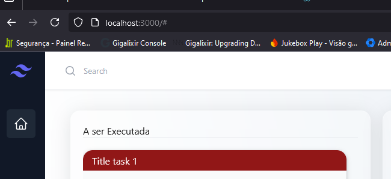
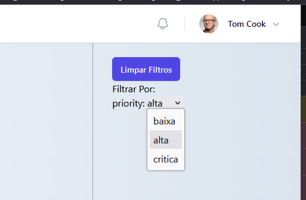

# Btime Test Front-End

This project was developed based on test instructions.

It was build with no one kanban lib, only base libs for design like tailwind and @headlessui/react.

The struct was divided in components and hooks. Components have all html structure and logic of templates and the hooks have all logic of business layer. It was divided css styles by scopes to make ease maintenance.

All data comming from back-end api, but the filters and search tasks running on the front-end.

#### To search any task just only click in search input on top left corner and write anything

#### To filter the tasks just only select a type selection on top right corner

#### To open more descriptions of any task just click in some task and it was open a modal with the extras descriptions.

## Available Scripts

In the project directory, you can run:

### `npm start`

Runs the app in the development mode.\
Open [http://localhost:3000](http://localhost:3000) to view it in the browser.

### `npm test`

Launches the test runner in the interactive watch mode.\

## Run by Docker

If can you start project by Docker run this commands

In the project directory, you can run:
### `docker build -t btime-test-front .`
### `docker run -d -p 3000:3000 btime-test-front:latest`